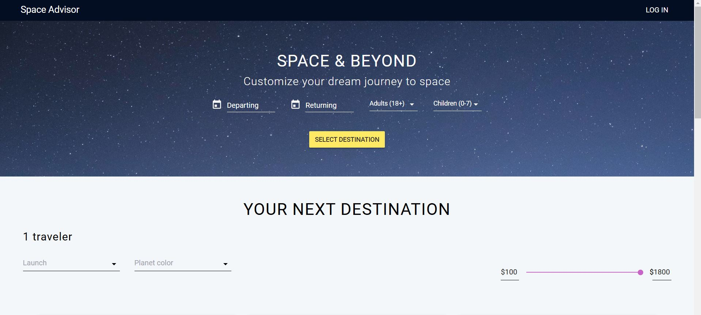

# 🌐 Space & Beyond website -  Automation Project 🌐
⭐ This is a testing automation demo project that tests 'Space & Beyond' site. ⭐

  <p align="left">
  
  </p>
  
🔗  https://demo.testim.io/


## 📖 Overview

This repository contains a comprehensive automated testing project built with Python, PyTest, and Allure Reports. 
The project follows the Page Object Model (POM) design pattern for a modular and maintainable test suite.


## 📑 Technologies & Skill & Features
| Technologies      | Description |
| ----------- | ----------- |
| **Python:**      | The project is developed using Python, providing a robust and widely used programming language for automation.       |
| **PyTest:**   | PyTest is used as the testing framework, offering powerful test configuration options, parallel execution, and detailed reporting.        |
| **Selenium WebDriver:**   | The project includes Selenium WebDriver for automating browser interactions        |
| **Page Object Model (POM):**   | The project follows the POM design pattern, enhancing test maintainability and reusability by separating page elements and actions.        |
| **Allure Reports:**   | Test results are documented using Allure Reports, providing a clear and interactive visualization of test execution.        |


## 📊 Reports
	install allure reports -  from PowerShell
	
  ```
  Invoke-Expression (New-Object System.Net.WebClient).DownloadString('https://get.scoop.sh')
  ```
  
  ```
  scoop install allure
  ```
<p>
   	Run suits by types of tests from terminal:
</p>

  ```
  pytest -m "functional or regression" --alluredir=allure-results
  ```

<p>
   	Viewing reports:
</p>

```
allure serve allure-results
```
   
## 📊 Reports Examples
<p>
  
</p>


## 📖 Prerequisites

- Install JDK.


## 🏁 Getting Started

1. **Clone the Repository:**
   ```bash
   git clone https://github.com/your-username/your-repo.git
    ```

## 📁 Project Structure
```
project_root/
│
├── data/              
│       
├── pages/             
│   
├── tests/            
│   └── allure-results
│
└── utills    

```
